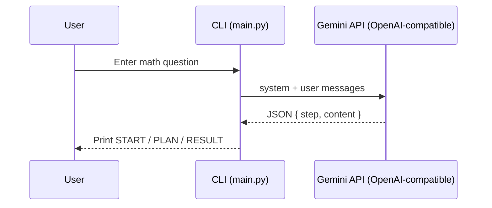

## 🧮 Chain-of-Thought CLI Math Assistant

An elegant, terminal-based AI assistant that thinks step-by-step to solve math problems. It uses a Chain-of-Thought (CoT) format to show a brief start, a plan, and the final result—so you learn from the reasoning, not just the answer.

---

## ✨ Introduction
This project provides a lightweight Command-Line Interface (CLI) that connects to an OpenAI-compatible endpoint for the Gemini LLM. Given a math question, the assistant produces structured JSON with CoT-style steps which are rendered as friendly, readable sections in your terminal.

---

## 🧰 Tech Stack
- Python
- OpenAI Python SDK (client library)
- Gemini LLM API via Google’s OpenAI-compatible REST endpoint

---

## 🚀 Features
- Interactive CLI with a friendly prompt
- Chain-of-Thought style output with clear sections:
	- START — kickoff context
	- PLAN — reasoning steps / approach
	- RESULT — final answer
- Uses `system.txt` to steer the assistant’s behavior (empty file will exit)

---

## 🗺️ How It Works (Architecture Overview)
1. You enter a prompt in the terminal.
2. `main.py` loads your system prompt from `system.txt` and creates a request using the OpenAI SDK.
3. Requests are sent to Google’s Gemini API through the OpenAI-compatible base URL.
4. The model returns JSON with `step` and `content` fields.
5. The CLI prints each step with clear labels and emojis (START, PLAN, RESULT).



---

## 📦 Requirements
- Python 3.8+
- Dependencies from `requirements.txt`
- A valid Gemini API key

---

## 🛠️ Install & Run Locally
1. Clone the repository and navigate into it:

```bash
git clone https://github.com/aman-tiwari001/CLI_AI_Assistant.git .
```

2. (Optional) Create/activate a virtual environment.
3. Install dependencies:

```bash
python -m pip install -r requirements.txt
```
4. Put your Gemini API key into `main.py`: Open `main.py` and replace the `GEMINI-API-KEY` placeholder with your real key.

5. Run the assistant:

```bash
python main.py
```

7. Type a math question when prompted. Enter `exit` to quit.

---

## ✅ Output Format
The model returns JSON and the CLI prints it as:
- 🚀 START — a short kickoff message
- 💡 PLAN — reasoning/steps
- 🔥 RESULT — the final answer

